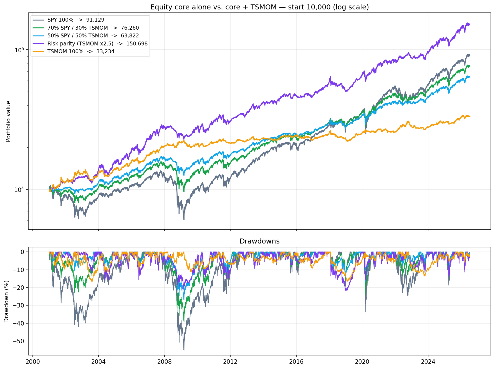

# Portfolio construction — risk allocation ≠ capital allocation

> **The lesson:** putting 30% of *capital* into a low-volatility strategy contributes
> only ~2.5% of portfolio *risk* — almost nothing. Diversification only pays when the
> building blocks contribute **equal risk**, not equal capital.
>
> ⚠️ **Read this first:** the risk-parity result below requires ~2.5× leverage on TSMOM,
> a strategy that already runs ~45× gross notional in its current (uncapped) form.
> That is ~120× notional — **not implementable**, with ETFs or futures. The number is
> the *theoretical ceiling*, and the reason a per-asset leverage cap is the top open
> item before real money. It is shown here to quantify what correct sizing is worth,
> not as a tradeable result.

## Question

TSMOM v2 has a lower total return than simply holding SPY (see `strategies/tsmom_v2`).
So — is it useless? Or does it earn its place *next to* an equity core rather than
instead of it?

## Setup

- Core: **SPY** buy-and-hold.
- Sleeve: **TSMOM v2, net of 5 bp** transaction costs.
- Blends rebalanced daily, start capital 10,000, period 2001–2026.
- `index_vs_tsmom.py` reproduces everything.

## Results

| Portfolio | Final | CAGR | Vol | Sharpe | MaxDD | Calmar |
|---|---|---|---|---|---|---|
| SPY 100% | 91,129 | 9.04% | 19.1% | 0.55 | **−55.2%** | 0.16 |
| 70% SPY / 30% TSMOM | 76,260 | 8.28% | 13.2% | 0.67 | −39.1% | 0.21 |
| 50% SPY / 50% TSMOM | 63,822 | 7.53% | 9.8% | 0.79 | −26.9% | 0.28 |
| **Risk parity (TSMOM ×2.5)** | **150,695** | **11.21%** | **12.5%** | **0.91** | **−21.8%** | **0.51** |
| TSMOM 100% | 33,234 | 4.82% | 7.7% | 0.65 | −16.9% | 0.29 |

Correlation SPY ↔ TSMOM: **−0.139** (slightly negative — better than the usual "zero" assumption).

## What this shows

1. **Capital-weighted blends cost you money.** 70/30 ends at 76k vs SPY's 91k. You buy a
   smoother ride (max drawdown −39% instead of −55%) and pay ~15k for it. Real trade-off,
   no free lunch.
2. **Risk-weighted, the picture flips.** Scaling TSMOM to SPY's risk level dominates on
   *every* axis: more money (151k vs 91k), lower volatility, less than half the drawdown,
   Calmar 0.51 vs 0.16. That is the diversification benefit, and it only appears when the
   sleeve actually carries risk.
3. **Percent ≠ euros.** Risk parity's max drawdown is *smaller* in % (−21.8% vs −55.2%) but
   *larger* in absolute terms (−17,127 vs −13,857), because the portfolio grew to a much
   higher level. Worth internalising before celebrating a low percentage.
4. **The constraint is implementation, not theory.** See the warning at the top: the
   leverage required is not fundable with the current uncapped sizing. Fixing position
   sizing (per-asset cap, portfolio-level vol targeting, dropping ultra-low-vol assets)
   is what would make any of this real.

## Takeaway

Diversification is the one genuine free lunch in finance — but only if you allocate
**risk**, not capital. A low-volatility sleeve at a modest capital weight is a rounding
error. This is why position sizing (Kelly, risk parity) matters at least as much as
finding the signal in the first place.
