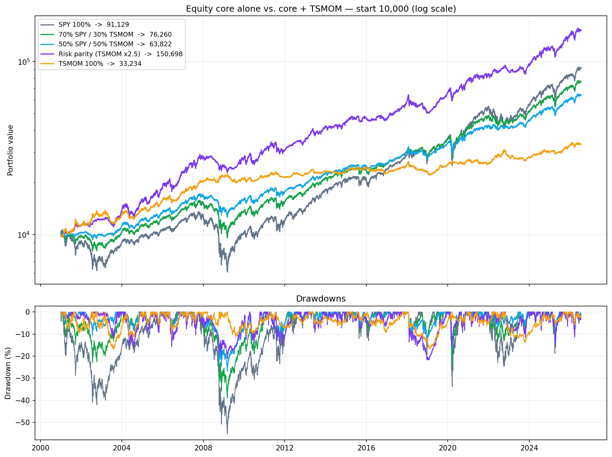

# Portfolio construction

Two parts: **(A) portfolio methods, crises & exposure** (below first), and
**(B) SPY + TSMOM as a sleeve** (the rest).

---

## A) The ladder of distrust, empirically

**Core lesson:** *the noisier the input you trust, the more fragile out-of-sample.*
Ladder of distrust: **expected returns (μ) ≫ correlations > vols.**

### `efficient_frontier.py` — five methods compared out-of-sample
Markowitz max-Sharpe · Min-Variance · Risk Parity (full & naive) · 1/N. Estimated
in-sample, traded out-of-sample (24 assets, IS 2007–2020, OOS 2020–2026).

Measured OOS Sharpe: **Min-Variance 2.74 · Markowitz 1.01 · 1/N 0.71 · RP naive 0.66 · RP full 0.29.**
Three findings:
- **"1/N beats Markowitz" is not a law** — here Markowitz beat 1/N OOS. DeMiguel holds *on average*, not always.
- **RP full (0.29) < RP naive (0.66)** — the full version uses the (noisy) correlations and gets *worse*. Ladder of distrust confirmed.
- **Sharpe without return misleads** — Min-Variance's 2.74 is a cash fund (2.2% return); 1/N returned 6.6% (3×). Always read return *and* risk. → `frontier.png`

### `correlation_crisis.py` — correlation breakdown: the two camps
The naive "everything goes to 1 in a crash" does *not* hold for a multi-asset book:
the average barely moves (2017 +0.16 → COVID +0.24), because the market splits into
two camps that cancel out. Correlation *to SPY* reveals it: **risk → +1** (QQQ 0.98 =
SPY, HYG 0.85 = junk-as-risk), **havens → negative** (IEF −0.55, yen −0.51, TLT/SHY).
Mechanism: forced deleveraging — "balance sheets, not assets". → `corr_crisis.png`

### `exposure_analysis.py` — the portfolio cap, measured not built
TSMOM book: **77% of days net long**, avg 12 long / 7 short — but it flips net short
in downturns (self-correcting). **Decision: no hard portfolio cap** — the long tilt
*is* the trend premium (capping bleeds return), a cap raises N and worsens the
deflated t. The residual risk (a sudden crash while long) is covered by position
sizing + kill-switch. → `exposure.png`

---

## B) Risk allocation ≠ capital allocation (SPY + TSMOM)

> **The lesson:** putting 30% of *capital* into a low-volatility strategy contributes
> only ~2.5% of portfolio *risk* — almost nothing. Diversification only pays when the
> building blocks contribute **equal risk**, not equal capital.
>
> ⚠️ **Read this first — two reasons the risk-parity row is a ceiling, not a result:**
>
> **1. Leverage is not fundable.** It requires ~2.5× leverage on TSMOM, a strategy that
> already runs ~45× gross notional in its current (uncapped) form — i.e. ~120× notional.
> Not implementable, with ETFs or futures. A per-asset leverage cap is the top open item
> before real money.
>
> **2. Financing costs are NOT included.** The blend runs 175% gross exposure, so 75% is
> borrowed — and that interest is not deducted below (see "Financing drag"). At realistic
> retail margin rates the return advantage disappears entirely. Only the *risk* advantage
> survives.

## Question

TSMOM v2 has a lower total return than simply holding SPY (see `strategies/tsmom_v2`).
So — is it useless? Or does it earn its place *next to* an equity core rather than
instead of it?

## Setup

- Core: **SPY** buy-and-hold.
- Sleeve: **TSMOM v2, net of 5 bp** transaction costs.
- Blends rebalanced daily, start capital 10,000, period 2001–2026.
- `index_vs_tsmom.py` reproduces everything.

## Results

| Portfolio | Final | CAGR | Vol | Sharpe | MaxDD | Calmar |
|---|---|---|---|---|---|---|
| SPY 100% | 91,129 | 9.04% | 19.1% | 0.55 | **−55.2%** | 0.16 |
| 70% SPY / 30% TSMOM | 76,260 | 8.28% | 13.2% | 0.67 | −39.1% | 0.21 |
| 50% SPY / 50% TSMOM | 63,822 | 7.53% | 9.8% | 0.79 | −26.9% | 0.28 |
| **Risk parity (TSMOM ×2.5)** | **150,695** | **11.21%** | **12.5%** | **0.91** | **−21.8%** | **0.51** |
| TSMOM 100% | 33,234 | 4.82% | 7.7% | 0.65 | −16.9% | 0.29 |

Correlation SPY ↔ TSMOM: **−0.139** (slightly negative — better than the usual "zero" assumption).

## What this shows

1. **Capital-weighted blends cost you money.** 70/30 ends at 76k vs SPY's 91k. You buy a
   smoother ride (max drawdown −39% instead of −55%) and pay ~15k for it. Real trade-off,
   no free lunch.
2. **Risk-weighted, the picture flips.** Scaling TSMOM to SPY's risk level dominates on
   *every* axis: more money (151k vs 91k), lower volatility, less than half the drawdown,
   Calmar 0.51 vs 0.16. That is the diversification benefit, and it only appears when the
   sleeve actually carries risk.
3. **Percent ≠ euros.** Risk parity's max drawdown is *smaller* in % (−21.8% vs −55.2%) but
   *larger* in absolute terms (−17,127 vs −13,857), because the portfolio grew to a much
   higher level. Worth internalising before celebrating a low percentage.
4. **The constraint is implementation, not theory.** See the warning at the top: the
   leverage required is not fundable with the current uncapped sizing. Fixing position
   sizing (per-asset cap, portfolio-level vol targeting, dropping ultra-low-vol assets)
   is what would make any of this real.

## Financing drag — the missing cost

The risk-parity blend holds 175% gross exposure (50% SPY + 125% levered TSMOM), so **75%
of capital is borrowed**. The table above does **not** deduct that interest. Correcting it:

`financing drag = 0.75 × borrowing rate`

| Borrowing rate | Drag | CAGR after financing | vs SPY (9.04%) |
|---|---|---|---|
| 2% (historical avg. risk-free) | −1.5% | 9.7% | marginally better |
| 4% (current risk-free) | −3.0% | 8.2% | **worse** |
| 6% (typical retail margin) | −4.5% | 6.7% | **clearly worse** |

**So the return advantage is fragile and depends entirely on funding cost.** What survives
regardless is the *risk* advantage — 12.5% vol instead of 19.1%, and −21.8% max drawdown
instead of −55.2%. Interest does not eat that. The honest framing is therefore not
"more money and less risk", but "**similar money at roughly half the drawdown**" — and only
if funding is cheap.

This is also an argument for futures over margin borrowing: with futures the financing is
embedded in the contract (cash collateral earns interest, the price carries the cost of
carry), so the effective rate is close to risk-free rather than a retail margin rate.

## Takeaway

Diversification is the one genuine free lunch in finance — but only if you allocate
**risk**, not capital. A low-volatility sleeve at a modest capital weight is a rounding
error. This is why position sizing (Kelly, risk parity) matters at least as much as
finding the signal in the first place.
