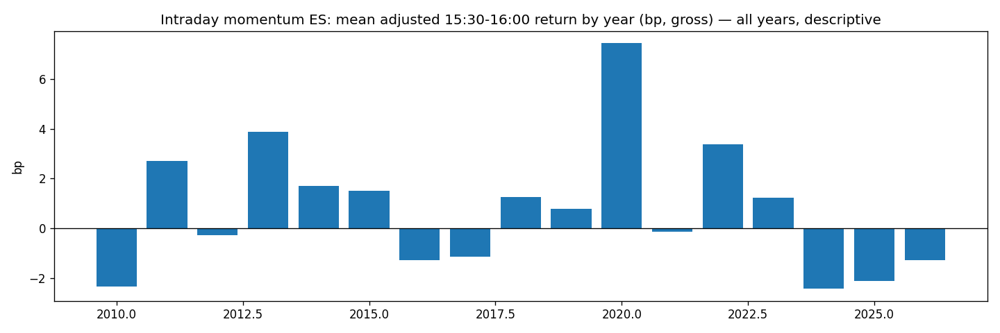

# Market Intraday Momentum — ES last 30 minutes, conditional on dealer gamma

**Status: ⚰️ Dead (both variants) — [half-sentence: raw signal 0.8 bp in 2010–17, reversed sign in 2022–26; gamma sign does not separate]**
**Case 5 | October 2026 | fourth full run · literature-anchored · two non-overlapping samples · closes the GEX project (H2)**

---

## Why this one

[2–3 sentences: strongest published mechanism of the week (gamma hedging = forced flow), prop-box fit (flat at 16:00, daily), and own data edge: a 1,068-day dealer-GEX series from signed tick flow]

**Sources:** Gao, Han, Li, Zhou (2018) *Market Intraday Momentum* · Baltussen, Da, Lammers, Martens (JFE 2021) *Hedging Demand and Market Intraday Momentum* — 60+ futures 1974–2020, last-30-min return predicted by rest-of-day return, stronger when gamma is more negative, reverts over following days · counter-evidence: arXiv 2026 falsification of OHLCV intraday signals on MNQ (11 of 14 families below the friction floor).

---

## Mechanism

[short-gamma option market makers and leveraged ETFs must hedge in the direction of the move → forced flow into the close → continuation; the effect should scale with how negative dealer gamma is]

---

## Pre-registration (written before touching the data)

- V1: adjusted return = r(15:30 open → 15:59 close) × sign(r(previous close → 15:30 open)). Sample 2010–2021, IS 2010–2017 / OOS 2018–2021.
- V2: same, restricted to days with own dealer-GEX series; test negative-GEX vs positive-GEX days. Sample 2022–2026, **one-look test, no own OOS** (decided at gate 1: split would leave the group comparison underpowered, min. detectable difference ≈ 5 bp).
- Dead if: adjusted net mean < **3.5 bp** (cost 0.57 pt = 1.14 bp × 3: 1.75 $/side + 1-tick spread + 1-tick slippage)
- Dead if: adjusted mean ≤ 0 (last half hour does not follow the day)
- Dead if: latest sub-sample net ≤ 0
- Dead if: top-5 days carry > 50 %
- Dead if (V2): negative-GEX days not ≥ **4 bp** above positive-GEX days (detectability of the difference ≈ 4.2 bp)
- Noise 27.7 bp/trade → V1 SE 0.62 (min. 1.9 bp) · V2 SE 1.28 (min. 3.8 bp). Variants counted: 2.

---

## Parameters

| Parameter | Value |
|-----------|-------|
| Instrument | ES futures, Databento GLBX 1-min OHLCV |
| Contract | front month = highest volume per day |
| Signal | previous 15:59 close → 15:30 open (includes overnight), New York time |
| Trade | 15:30 open → 15:59 close, in the direction of the signal |
| Gamma (V2) | own 0DTE dealer-GEX series (`gex_total`, 2022-05 → 2026-08, 1,068 days), sign |
| Cost | 1.14 bp round-trip |
| Validation | inject +10 bp in signal direction → 10.00 · hand checks · independently re-implemented, identical |
| Samples | V1 IS 1,884 days (2010–2017) · V2 1,049 days, 744 negative-GEX (71 %) |

---

## Results

**V1 — IS 2010–2017**

| | n | adjusted gross (bp) | net (bp) |
|---|---|---|---|
| all days | 1,884 | **+0.76** | −0.38 |
| signal up | 1,010 | +0.78 | |
| signal down | 874 | +0.74 | |

t ≈ 1.2 · pot net −717 bp · PF 0.95 · max DD −1,419 bp · worst −294 · best +262 · win rate 47 %. OOS 2018–2021 never opened (died at gate 4).

**V2 — 2022–2026, one look**

| | n | adjusted gross (bp) | std |
|---|---|---|---|
| GEX positive | 305 | **−0.77** | 24.8 |
| GEX negative | 744 | **−0.41** | 23.9 |
| difference | | **+0.36** (needed ≥ 4) | |

Both groups negative: in 2022–2026 the last half hour slightly *reverses* the day. Gamma sign does not separate.

*Descriptive, drawn after the verdict: yearly mean of the adjusted return, all years.*

---

## Verdict

[V1 sentence · V2 sentence — metric vs threshold → dead, scope]

---

## What I learned

- [raw intraday momentum in ES is a 0.8 bp whisper in 2010–17 and reversed after ~2018 — consistent with own P07 (LETF late-day, dead 2019+), the MNQ falsification, and the authors' own later "end-of-day reversal" work]
- [GEX project closed: H1 (vol, Aug 2026) and H2 (direction, today) both dead — the 691-million-row dealer-GEX series predicts neither; tool stays, signal does not exist]
- [week-level lesson, now four times measured: sub-hour price-pressure effects in ES are real mechanisms smaller than the retail spread since ~2018 — a cost-hostile zone; search space moves to longer holding periods and own-niche data (TSMOM audit, near-ATM 0DTE premium)]
