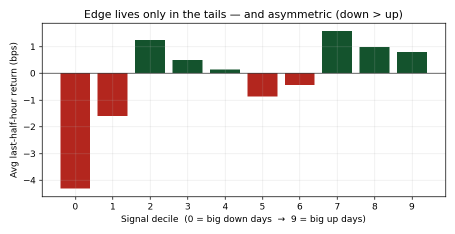
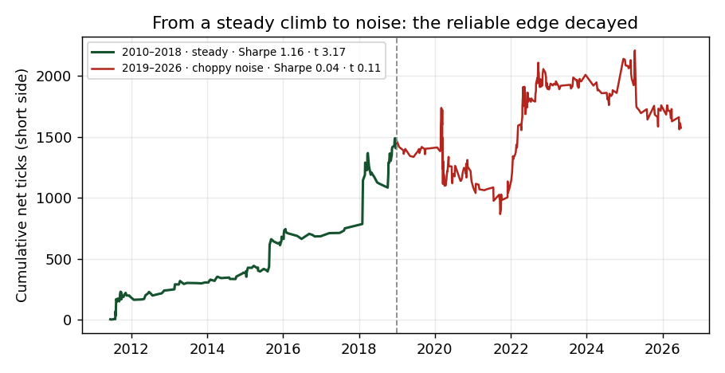
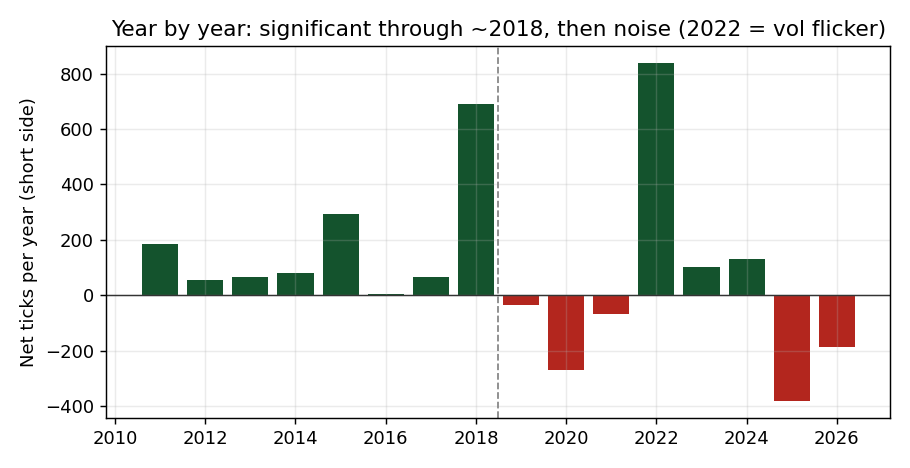

# LETF Late-Day Continuation — Leveraged-ETF Rebalancing Flow

**Status: ⚰️ Dead — a *real* edge that was arbitraged away (2010–2018 → gone after ~2019)**
**KW32 | August 2026**

---

## Why this one is different

ORB and ORR were signals that were **noise from the start**. This is the opposite and rarer case: a **real, significant edge that worked for years and then got competed away** once it became a known trade. I caught it mid-decay in my own data — a textbook McLean–Pontiff decay, measured rather than read about.

---

## Strategy Overview

Leveraged **and** inverse ETFs must reset their leverage to the daily target every day. The re-balancing is **always in the same direction as the day's move**: on an up day they add exposure (buy), on a down day they cut it (sell). This forced flow lands near the close and, on large-move days, is a big share of market-on-close volume — Cheng & Madhavan (2009) report **16–75 % of MOC volume** for a 1–15 % move. So on big-move days the last half hour should **continue** the day's direction.

| Parameter     | Value                                                                                      |
| ------------- | ------------------------------------------------------------------------------------------ |
| Instrument    | ES futures (Databento 1-min, front-month, RTH), 2010–2026, 4021 days                       |
| Signal window | 09:30 → 15:30 ET (how the day moved)                                                       |
| Trade window  | 15:30 → 16:00 ET (the last half hour we try to capture)                                    |
| Universe      | big-move days only — day's move in the extreme 10 % tails                                  |
| Direction     | continuation — long big up-days, short big down-days                                       |
| Threshold     | **expanding-window** 10/90 percentile, past days only, 252-day burn-in (**no look-ahead**) |
| Cost          | 1.3 ticks round-turn                                                                       |

---

## Diagnostic — the full sample hides the story

On the whole sample the edge looks like nothing:

| Slice | n | Net (ticks) | t | Sharpe |
|-------|---|-------------|---|--------|
| Both sides | 786 | +1.50 | 0.73 | 0.19 |
| **Short** (big down days) | 383 | **+4.11** | 1.23 | 0.32 |
| Long (big up days) | 403 | −0.97 | −0.39 | — |

Two splits — **both stated a priori**, from the mechanism and the EDA — reveal what the average buries:

**Side split.** The mechanism predicts the effect is strongest where re-balancing is largest and most violent: **big down days**. It is. The **long side never worked** (net −0.97, dead) and only diluted the short side. Trade short only.

**Recency split.** LETFs were tiny in 2009 and grew enormously; the naïve prediction was "bigger flow → stronger effect." The data says the **opposite**:

| Short side | n | Gross | Net (ticks) | t | p | Sharpe |
|------------|---|-------|-------------|---|---|--------|
| **2010–2018** | 151 | +10.84 | **+9.54** | **+3.17** | 0.002 | **1.16** |
| **2019–2026** | 232 | +1.87 | +0.57 | +0.11 | 0.912 | 0.04 |

A real, **significant** edge through 2018 (clears the t > 3 bar) — then a collapse to noise. The reliable, steady climb becomes a choppy coin flip. It briefly reappears in the 2022 high-volatility bear (when big down days were frequent again), but it is no longer a dependable, tradeable edge.

---

## Key Lessons

1. **Publication starts a ramp, not a cliff.** Cheng & Madhavan published the mechanism in 2009, but the edge survived until ~2018 — while LETF assets kept growing, the flow grew faster than the arbitrage against it, and trading the closing auction with size takes years of capital + infrastructure to arrive. Decay is gradual.
2. **Evidence beats the mechanism story.** I predicted the effect would get *stronger* with LETF growth. It got *weaker*. When the data disagrees with your reasoning, the data wins — you swap the hypothesis, not the result.
3. **The full-sample average lies; splits tell the truth.** t = 0.73 overall hid a t = 3.17 early edge and a t = 0.11 dead tail. This is exactly why out-of-sample and recency splits exist.
4. **"Survives costs" ≠ "is real."** Unlike ORB, the net P&L was positive — but positive-and-insignificant is not tradeable. Significance is the deciding test.
5. **No look-ahead in the threshold.** The 10 % tail is an expanding-window quantile from past days only, so the early-period significance is defensible rather than an artifact of the full-sample distribution.

---

## Plots

**Edge lives only in the tails, and asymmetric (down > up):**



**The decay, measured — a steady, significant climb turning into noise:**



**Year by year — significant through ~2018, then noise (2022 = volatility flicker):**



---

## Files

| File | Description |
|------|-------------|
| `letf_backtest.py` | Full backtest: expanding-window threshold (no look-ahead), continuation trade, side + recency splits |
| `plots/` | Decile edge, decay equity curve, annual net-ticks |

## Dependencies

```
pip install pandas numpy scipy pyarrow matplotlib
```

Data: Databento GLBX.MDP3 ES 1-min OHLCV, cleaned to front-month-by-volume (not shipped here). Point `DATA_PATH` at your cleaned parquet.

Mechanism reference: Cheng, M. & Madhavan, A. (2009). *The Dynamics of Leveraged and Inverse Exchange-Traded Funds.* Journal of Investment Management.

---

*Documented and archived KW32, August 2026 — reference, not for live trading. A real edge, measured on its way to the graveyard.*
