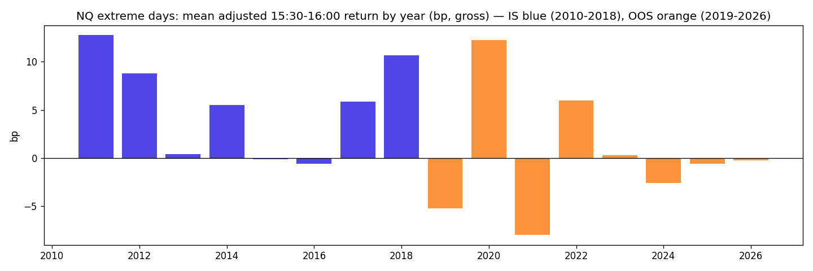

# Leveraged-ETF Rebalancing Flow — NQ, last 30 minutes on extreme days

**Status: ⚰️ Dead by the pre-registered OOS rule — [half-sentence: mechanism fully confirmed 2010–2018, premium gone since ~2021]**
**Case 6 | October 2026 | fifth full run · sister of `letf_late_day` (ES, P07) on the index where the forced flow is large**

---

## Why this one

[2–3 sentences: purest forced flow in the backlog (prospectus-mandated daily reset, direction/size/timing from a formula, size known only at 15:30), growing AUM, and the ES case died with "flow only 1.4 % of close liquidity" — Nasdaq-100 is where the leveraged ETFs live]

**Sources:** Cheng & Madhavan (2009) · Baltussen, Da, Lammers, Martens (JFE 2021) · own case P07 (ES: 2010–18 t 3.17 → 2019–26 t 0.11) · Bloomberg 2024: record $117bn in leveraged/inverse ETFs, ~$7bn of selling per 1 % drop (Morgan Stanley).

---

## Mechanism

[daily leverage reset → after up-days buy, after down-days sell, bull and bear in the same direction, flow = L(L−1) × AUM × daily return → lands in the closing phase; universe TQQQ (+3), SQQQ (−3), QLD, QID, PSQ — flow weight ≈ $190–200bn × r]

**Deviation from P07, decided before the data:** signal measured from the *previous close* (NAV return drives the reset), not from 09:30.

---

## Pre-registration (written before touching the data)

- Condition: previous close → 15:30 return in the top/bottom decile, **expanding-window quantiles, shifted one day, 252-day burn-in** (no look-ahead, as in P07).
- Window 1: 15:30 open → 15:59 close, in the direction of the day. Window 2 (anticipation check): 15:00 → 15:30, conditioned on the return up to 15:00.
- Dead if: adjusted net < 1 bp (NQ cost 0.35 bp × 3) · adjusted mean ≤ 0 · extreme days not ≥ 1 bp above normal days · OOS 2019–2026 net ≤ 0 · top-5 > 50 %.
- Noise: ~50 bp/trade on extreme days → SE 3.3 bp at N≈225 → detectable ≥ 10 bp (noise binds, not cost). Impact estimate (square-root rule, $4bn flow / $200bn daily NQ notional): 14–35 bp.
- Splits: IS 2010–2018 / OOS 2019–2026 (same split as P07 → direct ES/NQ comparison). Variants counted: 2.
- **Gate-6 rule, written before the OOS look:** alive only if OOS net > 0 AND HAC-t over IS+OOS ≥ 3; dead if OOS ≤ 0.

---

## Parameters

| Parameter | Value |
|-----------|-------|
| Instrument | NQ futures, Databento GLBX 1-min OHLCV, June 2010 – July 2026 |
| Contract | front month = highest volume per day |
| Signal | previous 15:59 close → 15:30 open (window 1) / → 15:00 open (window 2), New York time |
| Trade | 15:30 open → 15:59 close (window 1) |
| Cost | 0.35 bp round-trip (1.75 $/side + 1-tick spread + 1-tick slippage; NQ tick = 0.125 bp) |
| Validation | targeted inject +10 bp on extreme days → +10.00 / control 0.00 · hand checks · independently re-implemented, identical |
| Sample | extreme days: IS 339 / OOS 539 (of 4,019 days) |

---

## Results

**IS 2010–2018 — window 1 (15:30–16:00)**

| | n | adjusted gross (bp) | net (bp) |
|---|---|---|---|
| extreme days | 339 | **+5.91** | **+5.56** |
| after down-days | | +6.56 | |
| after up-days | | +5.21 | |
| normal days | 1,792 | +0.14 | |
| difference | | **+5.77** | |

Win rate 57 % · PF 1.54 · pot +1,884 bp · top-5 49 % · worst −212 · best +256 · **t naive 2.48, t HAC(5) 2.15 — below the hurdle of ~3.2 (2 variants); the gate-1 detectability (≥ 10 bp) was not reached**

**IS — window 2 (15:00–15:30):** extreme +0.25 vs normal +0.33 — **no anticipation in the half hour before the close**; the push sits exactly where the forced flow is.

**OOS 2019–2026 — one look**

| | n | gross (bp) | net (bp) |
|---|---|---|---|
| extreme days | 539 | +2.06 | +1.71 |

Win rate 50 % · PF 1.11 · top-5 = **174 % of the pot** · worst **−436 bp** · by year: 2019 −5.3 · **2020 +12.2** · 2021 −8.0 · 2022 +6.0 · 2023 +0.2 · 2024 −2.6 · 2025 −0.6 · 2026 −0.3
**Combined IS+OOS: N 878, net +3.20 bp, t HAC 1.68 — rule condition (b) fails.**

---

## Verdict

[your sentence: OOS > 0 only through 2020; combined t 1.68 < 3 → dead by the pre-registered rule; scope]

---

## What I learned

- [first case this week in which every mechanism test passed on IS: only on extreme days, both directions, exactly in the forced-flow window, no anticipation before it, net 5.6 bp at PF 1.54 over nine years — and then it died in the OOS on *time*, not on direction or cost]
- [the ES/NQ comparison answers the question: the liquidity share mattered (NQ lived where ES did not), but the premium still got absorbed once enough capital knew the formula — "necessary, not sufficient", measured with 878 days; McLean–Pontiff and sunshine trading in own data]
- [the gate-6 rule written before the look prevented reading 2020 as proof]
- [prop reality: worst extreme-day trade −436 bp = 85 % of a 50K drawdown with one MNQ — the days you would trade are the days the box kills you]
- [card stays with a trigger: alive in high-vol regimes (2011/2015/2018/2020/2022), dead in calm ones → possible V3 conditional on a vol regime, on data not yet seen]
