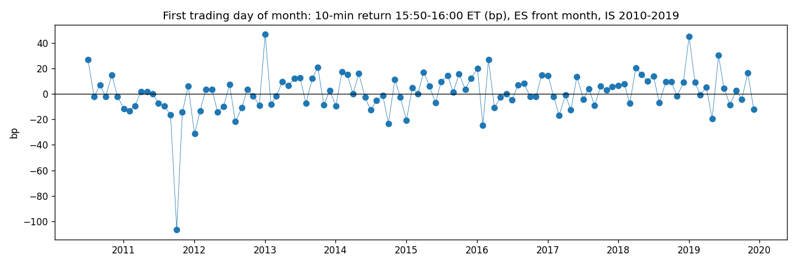

# Month-Start Inflow — ES, last 10 minutes of the first trading day

**Status: ⚰️ Dead — [one half-sentence: right direction, too small to detect or to pay for]**
**Case 3 | October 2026 | second full run through the 9-gate protocol · gate 4 on IS only**

---

## Why this one

[2–3 sentences: mirror of case 2 — new money instead of rebalancing, unconditional (always buy), same pipeline]

---

## Mechanism

[payroll / 401k / savings-plan contributions arrive at month start → funds must invest (cash = tracking error) → index funds invest at the close because the close is their benchmark]

**Prior burden (written at gate 0):** case 2 showed rebalancing flows are not visible in this window. Inflows might differ because they are pure buys without an offsetting leg — unproven.

---

## Pre-registration (written before touching the data)

- Dead if: net mean < 2 bp per trade
- Dead if: month-start not ≥ 2 bp above the control group (all other days, same window)
- Dead if: 2023–2026 net ≤ 0
- Dead if: top-5 month-starts carry > 50 % of the total
- Threshold derived: cost 0.7 bp × 3 = **2 bp** · noise 16 bp/trade → SE 1.5 bp at N 114 → detectable effect ≥ **4.5 bp**
- Splits: IS 2010–2019 / OOS 2020–2026 (OOS unopened — case died at gate 4) · variants counted: **1**

---

## Parameters

| Parameter | Value |
|-----------|-------|
| Instrument | ES futures, Databento GLBX 1-min OHLCV, June 2010 – July 2026 |
| Contract | front month = highest volume in the window, per day |
| Window | 15:50 open → 15:59 close, New York time (tz-aware) |
| Event | first trading day of the month, derived from the data (previous row in a different month) |
| Control | all non-month-start days, same window, same years |
| Cost | 0.7 bp round-trip |
| Validation | inject test +10 bp → 10.00 recovered · 3 days checked by hand (2010, 2010, 2024) · independently re-implemented, identical numbers |
| Sample | IS only: 114 month-starts, 2,266 control days |

---

## Results (IS 2010–2019)

| | n | gross (bp) | net (bp) |
|---|---|---|---|
| Month-start | 114 | **+0.95** | +0.25 |
| Control (other days) | 2,266 | −0.67 | |
| Difference | | **+1.62** | |

Pot net +28 bp · top-5 month-starts +172 bp (= 608 % of the pot — everything else is net negative) · profit factor 1.05 · max drawdown −293 bp · worst −107 bp (Aug 2011) · best +46 bp · win rate 51 %

---

## Verdict

[your verdict sentence, translated: net 0.25 vs. 2 bp → dead; sentences 1, 2, 4 fired; direction correct, effect below detection (t ≈ 0.6); scope]

---

## What I learned

- [cases 2 + 3 together: fund flows that "must" hit the close — rebalancing and inflows — are not measurable in the last 10 minutes of ES. Dead end signposted: no more "funds must X → ES 15:50–16:00" hypotheses]
- [control group matters: this window drifts slightly negative on normal days (−0.67 bp) — post hoc, card only]
- [right direction + too small = the most common outcome; pre-registration keeps it from becoming "almost works"]
