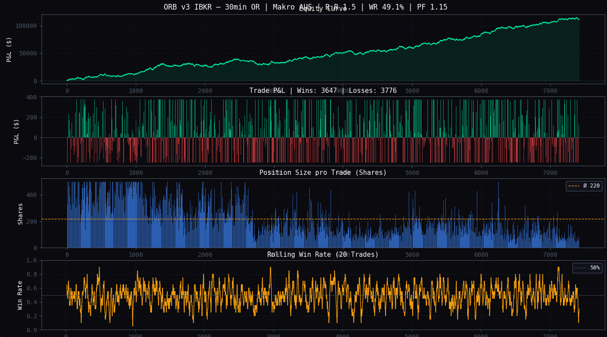
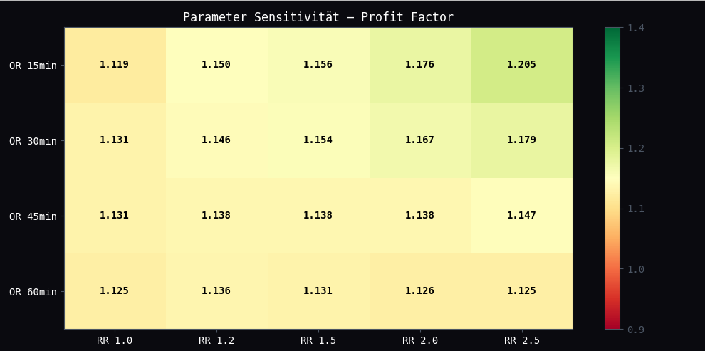
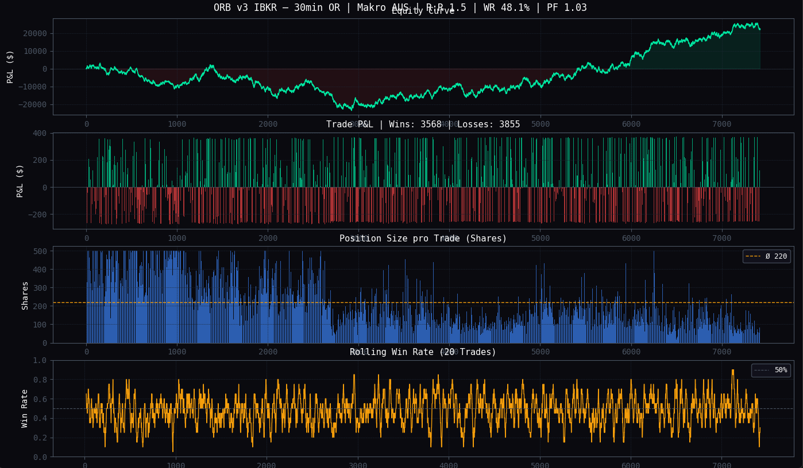
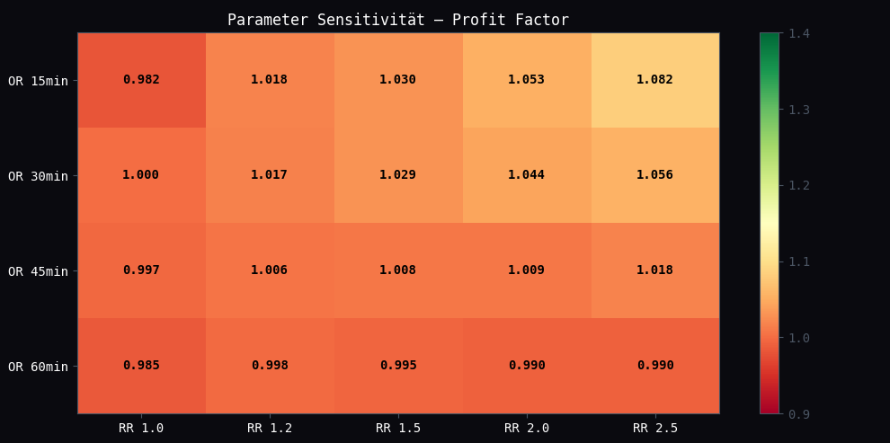

# ORB Prop Firm Strategy — Opening Range Breakout

**Status: ❌ Abandoned — Slippage & Commission destroy edge**
**KW27 | Juli 2026**

---

## Strategy Overview

Opening Range Breakout on SPY, QQQ, IWM targeting Lucid Trading 50K FLEX EVAL prop firm accounts.

| Parameter | Value |
|-----------|-------|
| Instruments | SPY, QQQ, IWM |
| Opening Range | First 30 min (09:30–10:00 ET) |
| Entry Long | Break above OR High |
| Entry Short | Break below OR Low |
| Stop | Other side of range |
| Target | 1.5× OR Range (RR = 1.5) |
| Position Sizing | $250 / OR_Range (max 500 shares) |
| Slippage | $0.05/share |
| Commission | $1.00 round-trip (Lucid: $0.50/side) |

---

## Prop Firm Model

Lucid Trading 50K FLEX EVAL:
- Fee: $98
- Profit target: $3,000
- Trailing max loss: $2,000

**EV formula:** `EV = P(Pass) × $3,000 − P(Bust) × $98`
**Break-even pass rate:** 98 / 3,098 = **3.16%** — very low hurdle

---

## Development & Validation Results

### Step 1 — IS/OOS Split (without costs)

| Metric | In-Sample | Out-of-Sample |
|--------|-----------|---------------|
| Profit Factor | 1.14 | 1.17 |
| PF Decay | — | −21% ✅ (OOS > IS) |
| t-statistic | 5.43 | p ≈ 0 ✅ |

### Step 2 — Parameter Sensitivity

Grid search over RR (1.0–2.5) × OR_BARS (1–5):
- **20/20 combinations profitable (PF > 1.0)**
- No overfitting detected ✅

### Step 3 — Monte Carlo (1,000 simulations, OOS data)

| Metric | Without Costs |
|--------|--------------|
| Pass Rate | 51.2% |
| EV | $1,488 |
| Median trades to pass | 64 (~21 trading days) |

### Step 4 — RR Comparison (1.5 vs 2.5)

| RR | Win Rate | Pass Rate | EV |
|----|----------|-----------|-----|
| 1.5 | 49.4% | **53.3%** | $1,553 |
| 2.5 | 48.0% | 52.4% | $1,525 |

**Key insight:** Higher profit factor ≠ better prop firm performance. Higher win rate protects against trailing drawdown. RR=1.5 wins.

### Step 5 — Walk-Forward Analysis (2Y IS / 1Y OOS / 9 windows)

| Without Costs | With Slippage |
|--------------|---------------|
| 9/9 windows profitable ✅ | 6/9 windows profitable ⚠️ |
| Ø OOS PF: 1.150 | Degraded |

---

## Why It Was Abandoned — Transaction Costs

### Slippage ($0.05/share)

Slippage hits **both entry AND exit simultaneously**:
- Long entry: filled $0.05 above OR High → winner smaller AND loser bigger
- For ~150 shares: ~$15 total damage per trade (not $7.50)

### Commission (Lucid Micro-Futures: $0.50/side)

$1.00 round-trip per trade.

### Combined Impact

| Metric | Without Costs | + Slippage | + Commission |
|--------|--------------|------------|--------------|
| EV/Trade | ~$14 | ~$4 | ~$3 |
| t-statistic | 5.43 ✅ | 1.45 ❌ | not significant |
| Pass Rate | 51.2% | ~39% | ~35% |
| Walk-Forward | 9/9 ✅ | 6/9 ⚠️ | — |

---

## Key Lessons

1. **Backtests without transaction costs are lies.** A t-stat of 5.43 means nothing if costs bring it to 1.45.
2. **Rule of thumb: EV/Trade ≥ 3× (slippage + commission)** before serious validation. Here: $16 costs vs $14 EV → stop immediately.
3. **Check costs after the first backtest** — not after two weeks of development.
4. **Slippage always hits both sides** — entry and exit. Never count it as one-sided.
5. **Win rate protects trailing drawdown** — RR=1.5 beats RR=2.5 despite lower profit factor.
6. **Walk-forward is essential** — 9/9 OOS windows profitable without costs looked robust. With costs: edge evaporates.

---

## Results — Without Costs

| Equity Curve (WR 49.1% · PF 1.15) | Parameter Sensitivity |
|---|---|
|  |  |

---

## Results — With Slippage ($0.05/share) + Commission ($1.00/trade)

| Equity Curve (WR 48.1% · PF 1.03) | Parameter Sensitivity |
|---|---|
|  |  |

---

## Files

| File | Description |
|------|-------------|
| `orb_backtest.py` | Full backtest with slippage, commission, Monte Carlo, Walk-Forward, RR comparison |
| `plots/` | Equity curves and parameter sensitivity heatmaps (with and without costs) |

---

## Dependencies

```
pip install yfinance pandas numpy matplotlib scipy
```

---

*Documented and abandoned KW27 Juli 2026. Strategy archived for reference — not for live trading.*
