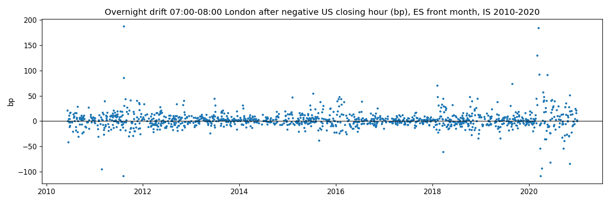

# Overnight Drift — ES, the hour before the European open, after a negative US closing hour

**Status: ⚰️ Dead — [half-sentence: mechanism confirmed and the Fed number replicated, but 2.4 bp gross vs. 1.6 bp night costs]**
**Case 4 | October 2026 | third full run · literature-anchored (NY Fed Staff Report 917) · gate 4 on IS only**

---

## Why this one

[2–3 sentences: first case with a published benchmark; conditional version from the paper (BtD, Sharpe 1.1 after costs, 2004–2020); prop-box fit (flat by 03:00 ET, daily, automated)]

**Source:** Boyarchenko, Larsen, Whelan — *The Overnight Drift*, NY Fed Staff Report 917 (2020, rev. 2022). Unconditional 2:00–3:00 ET return 1.48 bp/day (3.7 % annualized), 1998–2020. Long 2–3 every night: Sharpe 1.1 pre-cost, **−0.5 after bid-ask**. Conditional on negative closing order imbalance ("BtD"): Sharpe 1.8 pre-cost, **1.1 after cost**.

---

## Mechanism

[dealer inventory: market makers absorb the closing selloff, carry it overnight, get paid when European buyers arrive at the open → immediacy premium; bigger selloff → bigger inventory → bigger drift (asymmetry)]

---

## Pre-registration (written before touching the data)

- V1 (unconditional, every night): **dead per literature** (Sharpe −0.5 after cost) — not measured.
- V2 (this case): long ES 07:00→08:00 **London time** (the hour before the European open — not a fixed ET hour, because US/UK DST dates differ) on nights after a negative 15:00–16:00 ET closing hour (proxy for the paper's negative closing order imbalance; signed volume not available in OHLCV).
- Dead if: mean return after negative closing hours ≤ 0
- Dead if: drift after negative closing hours not ≥ 5 bp above drift after non-negative hours (control)
- Dead if: net mean < 5 bp (threshold = Lucid night cost 1.64 bp × 3: 1.75 $/side commission + 2-tick night spread + 1-tick slippage = 0.82 pt)
- Dead if: 2021–2026 net ≤ 0 (the years the paper does not cover)
- Dead if: top-5 nights carry > 50 % of the total
- Noise: ~21 bp/hour (conservative) → SE 0.56 bp at N 1,375 → detectable ≥ 1.7 bp. Binding constraint: cost, not noise.
- Splits: IS 2010–2020 (overlaps paper → benchmark) / OOS 2021–2026 (unopened — case died at gate 4) · variants counted: 2

---

## Parameters

| Parameter | Value |
|-----------|-------|
| Instrument | ES futures, Databento GLBX 1-min OHLCV, June 2010 – July 2026 |
| Contract | front month = highest volume per day (both windows) |
| Trade window | 07:00 open → 07:59 close, **Europe/London** (tz-aware) |
| Condition | previous trading day's 15:00 open → 15:59 close, **America/New_York** return < 0, shifted by one row (no look-ahead) |
| Control | nights after a non-negative closing hour |
| Cost | 1.64 bp round-trip (Lucid Trading fee table, Aug 2026, + night spread + slippage) |
| Validation | targeted inject +10 bp on condition nights → +10.00 / control 0.00 · 3 days by hand · independently re-implemented, identical |
| Sample | IS: 1,233 condition nights / 1,385 control nights (48 % / 52 %) |

---

## Results (IS 2010–2020)

| | n | gross (bp) | net (bp) |
|---|---|---|---|
| After negative closing hour | 1,233 | **+2.37** | +0.73 |
| Control (non-negative) | 1,385 | +0.85 | |
| Difference | | **+1.52** | |
| **All nights (unconditional)** | 2,618 | **+1.57** | — **paper: 1.48 bp** ✓ |

Pot net +899 bp · top-5 nights +677 bp (**75 %**: 2011-08-09, 2020-03-13, 2020-03-02, 2020-03-20, 2020-05-19) · PF 1.15 · max DD −285 bp · worst −110 · best +186 · win rate 48 %

**Diagnostic (discussed before the data, IS): drift by quintile of the previous closing hour**

| Quintile of closing-hour return | n | drift 07–08 London (bp) |
|---|---|---|
| Q1 — strongest selling | 524 | **3.85** |
| Q2 | 523 | 1.93 |
| Q3 | 524 | 0.01 |
| Q4 | 523 | 0.40 |
| Q5 — strongest buying | 524 | 1.64 |

---

## Verdict

[your verdict sentence: net 0.73 vs. 5 bp → dead; sentences 2, 3, 5 fired; direction and asymmetry confirmed; scope]

---

## What I learned

- [the pipeline replicates the Fed number: 1.57 vs 1.48 bp unconditional — calibration of the whole machine (two time zones, front month, London window)]
- [mechanism confirmed: ~3× drift after selling vs. not, monotone Q1→Q3 — the proxy is too coarse, it mixes −10 bp and −190 bp closes]
- [cause of death: cost ratio 1.4 instead of 3 — the premium belongs to the dealer; retail pays him the spread to take it. Third case this week dying on cost: 10-minute and 1-hour ES windows are a cost-hostile zone for retail]
- [new card: only after extreme closing hours (bottom quintile/decile) — but even Q1 is 3.85 bp < 5 bp threshold, and N shrinks; needs its own gate 0 and a cost-side answer (longer hold, lower cost venue) before it is worth code]
