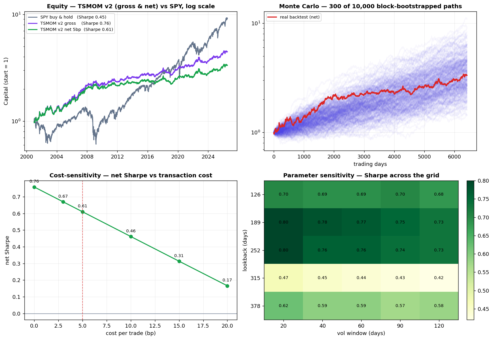

# TSMOM v2 — an honest re-validation of Time-Series Momentum

  

> A corrected rebuild of TSMOM after I found a **look-ahead bug** in v1 that had
> inflated the Sharpe to 1.86. The honest number — after costs *and* a
> multiple-testing correction — is a **net Sharpe of 0.61 (deflated t ≈ 1.8)**.
> It passes all five validation hurdles, but only narrowly. This repo documents the
> strategy, the full validation suite, and the mistakes found along the way.

**Paper:** Moskowitz, Ooi & Pedersen (2012), *Time Series Momentum*, JFE 104(2).
**Universe:** 24 assets — equities, bonds, commodities, FX (growing, from 2001).

---

## Why this repo is different

Most strategy repos show a polished equity curve. This one shows a strategy being
**stress-tested until it nearly breaks** — and left standing anyway:

- **Found and fixed a look-ahead bug.** v1 computed `position * returns.shift(1)`
  (the position already "knew" the return it was about to earn). The fix is
  `position.shift(1) * returns` — *decide today, earn tomorrow*. Sharpe 1.86 → 0.29
  on the old 5-ETF universe; 0.76 gross on the corrected 24-asset v2.
- **Turnover, not the cost rate, is the real test.** ORB died here (t 5.43 → 1.45).
  TSMOM survives (t 3.83 → 3.08) because its turnover is far lower (19.55/yr).
- **Deflated the Sharpe for multiple testing.** The raw t 3.08 flatters itself — it
  ignores that the *best of a 25-cell grid* beats zero partly by luck. After the
  Bailey–López de Prado correction: DSR 96.6%, deflated t 1.83. Still passes, barely.

## Files

- `tsmom_v2.py` — strategy: 12-month trend signal → vol-scaled position → returns.
- `validation.py` — the 5-hurdle suite: IS/OOS, sensitivity, Monte Carlo, costs, Deflated Sharpe.
- `plot_results.py` — generates `results.png` (equity vs SPY + Monte Carlo cone).

## Reproduce

```bash
pip install numpy pandas yfinance scipy matplotlib
python tsmom_v2.py        # strategy + gross metrics
python validation.py      # all 5 hurdles
python plot_results.py    # writes results.png
```

Daily data pulled live from Yahoo Finance. No API key needed.

## Results (KW28–29)

| Test | Result | Verdict |
|---|---|---|
| Significance (gross) | Sharpe **0.76** · t 3.83 · p 1.3e-4 · CI [+2.9%, +8.9%] | ✅ Hurdle 1 |
| IS / OOS | IS 0.80 → OOS 0.69 (14% decay, both significant) | ✅ Hurdle 2a |
| Sensitivity | all 25 cells positive (0.42–0.80), plateau at 126–252 lookback | ✅ Hurdle 2b |
| Monte Carlo | P(Sharpe>0)=100%, backtest = median, worst-5% DD **−26%** | ✅ robust |
| Costs | net Sharpe **0.61** (5 bp) · t 3.08 · turnover 19.55/yr | ✅ survives (conditional) |
| Deflated Sharpe | DSR **96.6%** · deflated t **1.83** (N=25, s_a 0.124) | ✅ passes multiple-testing |

Cost-sensitivity: 3 bp→0.67 · 5 bp→0.61 · 10 bp→0.46 (t<3) · 20 bp→0.16 (dead). **Cost-sensitive, not cost-proof.**



*Four-panel validation overview. **(1)** Equity — gross & net TSMOM vs SPY (log). Honest read: SPY wins on total return in this bull run; TSMOM wins on smaller drawdowns and near-zero correlation. **(2)** Monte Carlo cone — 10k block-bootstrapped **net** paths; the real backtest (red) sits in the middle, lower edge stays above 1. **(3)** Cost-sensitivity — net Sharpe vs transaction cost (survives 5 bp, thins fast beyond 10). **(4)** Parameter-sensitivity heatmap — Sharpe across the lookback × vol-window grid (the plateau = robustness).*

## Honest verdict

Passes all five hurdles — but each only narrowly. The honest number after everything is a
**deflated t ≈ 1.8**, not the raw 3.08: costs shrink the edge (net Sharpe 0.61) and the
multiple-testing correction shrinks it further. Survives where ORB died, because of far lower
turnover. Green for **paper trading at very small size**, not "all in". Kill-switch calibrated
to the Monte-Carlo worst-case drawdown (−26%), not the single-backtest −16.5%.

**Open before real money:** per-asset leverage cap (vol-scaling wants ~10× on SHY),
vol-dependent costs, real broker rates, and a factor regression — is the 0.61 real alpha,
or hidden beta?

---

*Part of a structured quant-research curriculum (KW26–49). Built to learn how to test a
strategy honestly — not to sell one.*
