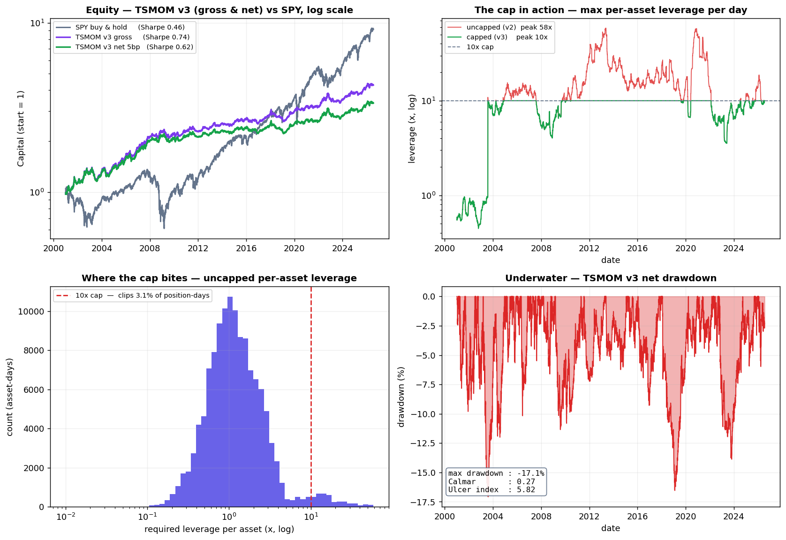

# TSMOM v3 — tradable (per-asset leverage cap)

**One-line story:** v2 was statistically valid but *untradeable* (asked for up to
58× leverage on a single asset). v3 adds one line — a per-asset leverage cap —
and becomes tradable **without losing anything**. It even improves.

## Results



- **Equity (top-left)** — v3 gross/net vs SPY on a log scale. Lower return than
  SPY, but far smoother: a risk sleeve, not a return engine.
- **The cap in action (top-right)** — max per-asset leverage per day. Uncapped
  (v2) spikes to ~58×; the 10× cap flattens the spikes without touching the body.
- **Where the cap bites (bottom-left)** — the uncapped leverage distribution. Only
  a thin tail sits beyond 10× — the noisy, quiet-asset churn the cap removes.
- **Underwater (bottom-right)** — the v3 drawdown curve, annotated with MaxDD,
  Calmar and Ulcer.

Regenerate with `python plot_results.py` (writes `results.png`).

## The change

```python
position = (target_vol / vol) * signal
position = position.clip(-10, 10)     # <- the entire difference vs v2
```

## Why 10× — and why it is not a fourth optimised parameter

The cap is **derived from the outside constraint that actually binds**, not
searched. Futures initial margin is ~5–10% of contract value → a broker lets you
carry roughly **10–20× per asset**, no more. We take **10×** as a hard cap.

This matters for the multiple-testing count: the cap is a **constraint we must
respect**, not a knob we tune. We tested exactly one value and asked a yes/no
question ("does the strategy survive it?"). So it adds nothing to N, and the
deflated t stays **1.83**.

## Result (net of 5 bp, 2000–2026)

| | v2 (uncapped) | **v3 (10× cap)** |
|---|---|---|
| max leverage / asset | 58.4× | **10.0×** |
| net Sharpe | 0.610 | **0.618** (t = 3.12) |
| turnover / yr | 19.55 | **16.11** |
| CAGR | 4.5% | 4.6% |
| max drawdown | −17.1% | −17.1% |
| Calmar | 0.26 | **0.27** |
| Ulcer index | 5.90 | **5.82** |
| implementability (hurdle 6) | ❌ fails | ✅ **passes** |

**The cap costs nothing — it improves both Sharpe and turnover.** The reason:
the extreme leverage sat on the *quietest* assets (SHY et al.), which moved huge
notional but contributed almost no portfolio risk *and* no return. Cutting it
removes the most expensive, most illiquid churn. **Gross notional is not risk.**

## Is TSMOM even worth trading vs. buy-and-hold?

On **return** alone, no — SPY compounds faster (9.0% vs 4.6% CAGR). On every
**risk** axis, yes:

| | TSMOM v3 | SPY |
|---|---|---|
| Sharpe | 0.62 | 0.46 |
| Calmar | 0.27 | 0.16 |
| Ulcer | 5.82 | ~15 |
| max drawdown | −17% | −55% |

It is a **risk tool, not a return tool** — a diversifying sleeve, not a
replacement. (See `research/portfolio_construction`.)

## Status & honest caveats

- **v3 is the tradable candidate.** The *running paper strategy is still v2* and
  stays frozen — v3 replaces it only via a deliberate version switch, never mid-run.
- **5 bp is an assumption, not a measurement** (same caveat as v2). Real per-asset
  broker spreads are the highest-value open item.
- **Open — a *portfolio*-level cap:** a 10×/asset cap does NOT stop all 24 assets
  from being long at once (a trending regime concentrates the book). That is a
  different tier of risk and is not addressed here.
- **Factor regression (KW32) still pending:** is the 0.62 own alpha, or bought
  momentum-factor exposure available cheaper in an ETF?

## Reproduce

```bash
python tsmom_v3.py
```

Data pulled live from Yahoo Finance, no API key.
